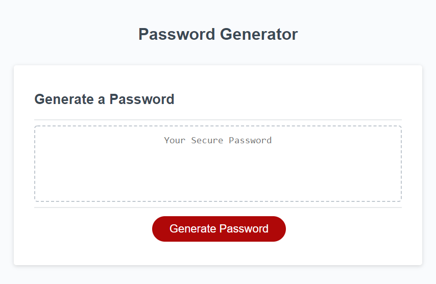
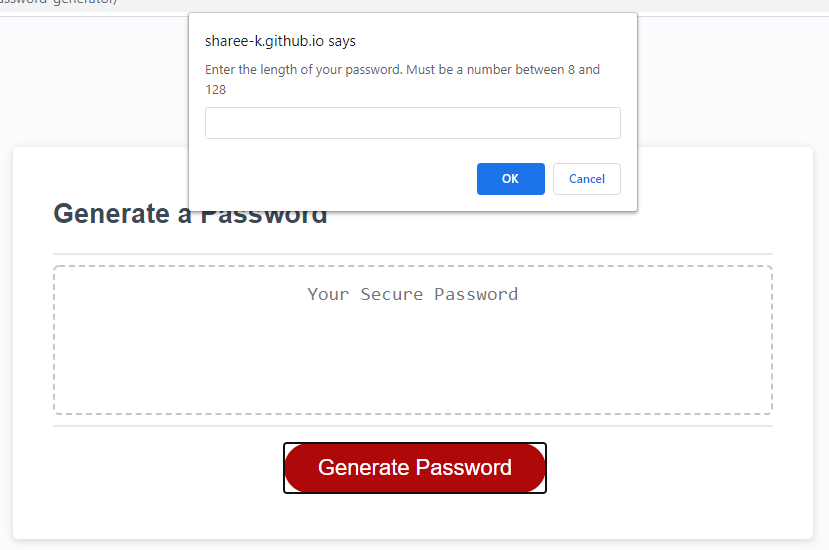
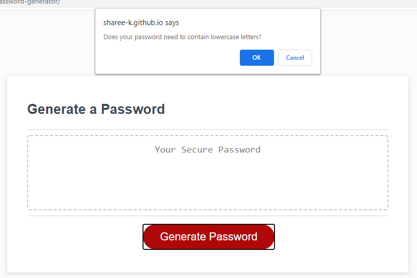
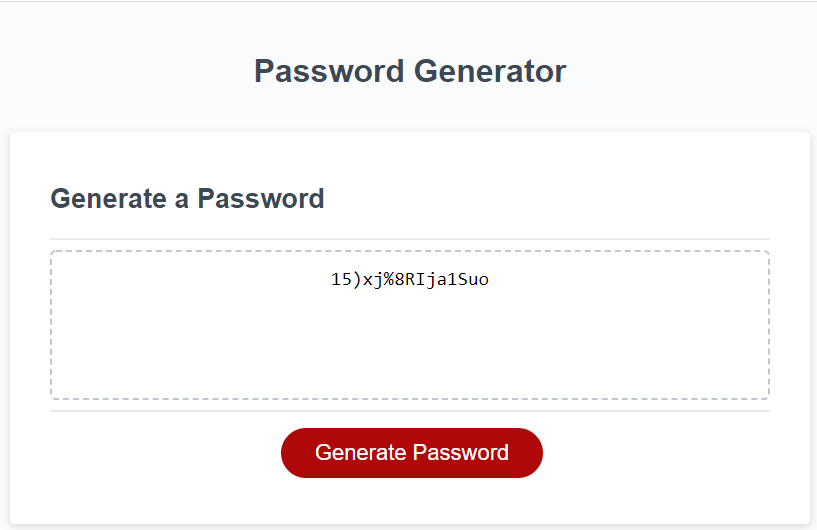

# Password Generator
> This is a simple password generator.

## Table of contents
* [General info](#general-info)
* [Screenshots](#screenshots)
* [Link](#link)
* [Status](#status)
* [Contribution](#contribution)

## General info
This project was built with HTML, CSS, and JavaScript.

## Screenshots
Landing page

Password Length Input

Password Criteria Prompts

Password Successfully Generated

## Link
https://sharee-k.github.io/password-generator/

## Status
This project is finished for this training challenge.

## Contribution
Sharee Burkeen (https://github.com/sharee-k)